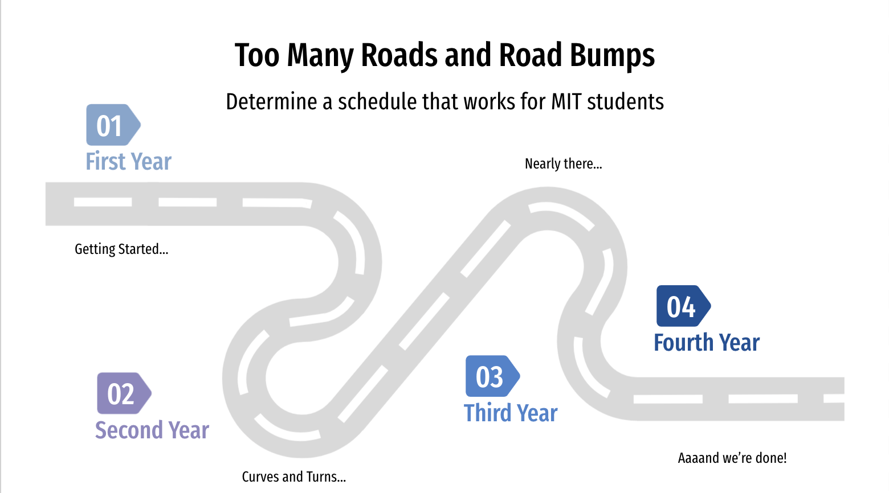
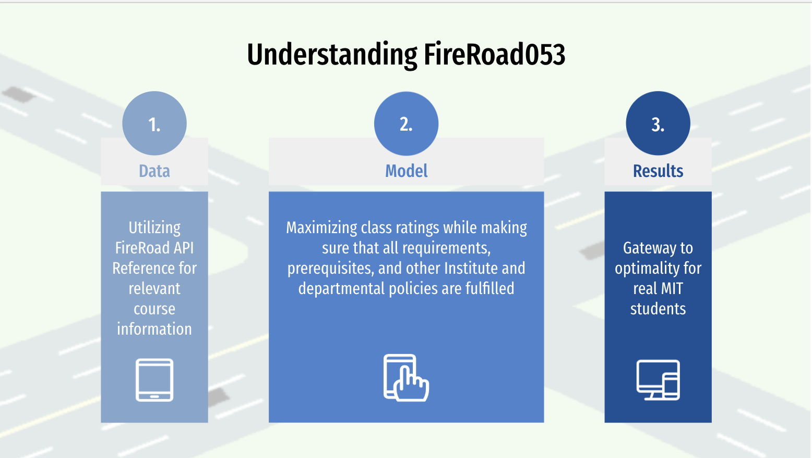
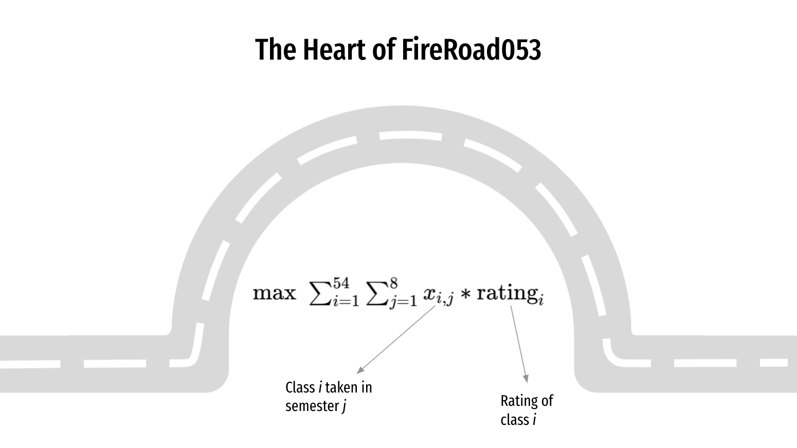
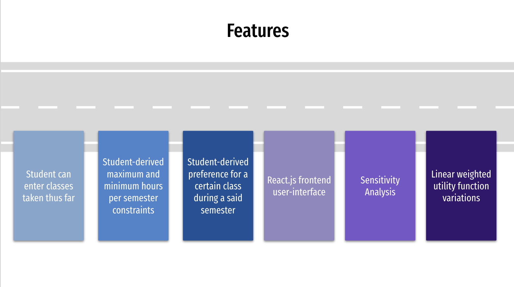
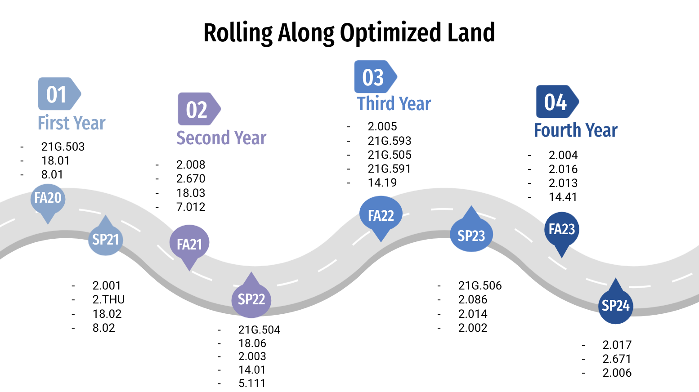
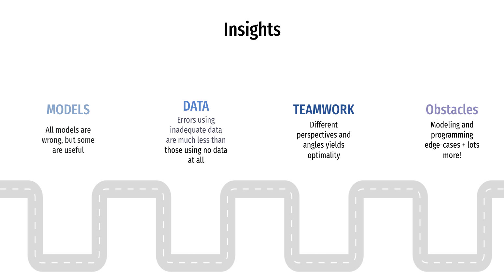
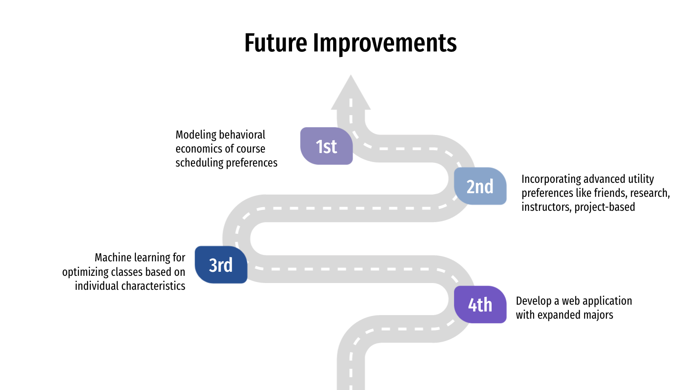

# Optimizing Course Planning for MIT Students

⮂ Press Arrow Keys To Transition ⮂

---

---

---

> Whenever you are designing optimization models, it’s typically impossible to 
> capture every single aspect of the problem
> <cite>Arthur Delarue </cite>

---

---

# ❤️

---

---

---

---

---

# 👏

---

# 🤗

---

# 😊

---

# 🎈

---

# 🙌

---

# 🎆

---

# 🎇

---

# 🥳

---

# 🎊

---

# The End 🎊

---

